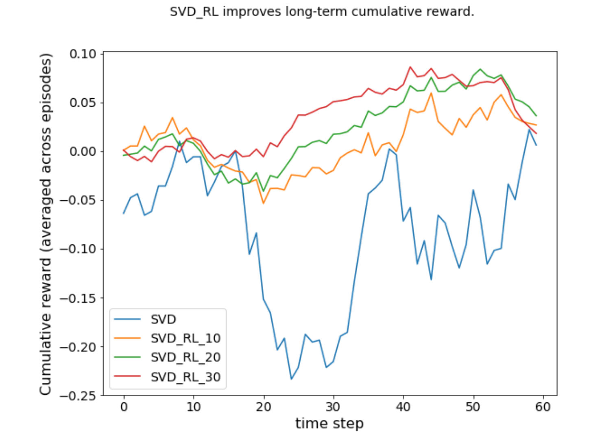

# Improving a Recommendation System with Reinforcement Learning

## Introduction
A recommendation system is usually myopic. For example, collaborative filtering based on matrix factorization (e.g. SVD, singular value decomposition) aims at picking an item which will be liked or purchased by a client immediately. In other words, a recommendation system usually aims at maximizing the "immediate reward", i.e. the recommender wants to recommend an item to a client who then purchases (or likes) it.

However, this myopic nature of a recommender may hurt the long-term engagement of a client. For example, a recommender of a movie streaming website may keep recommending action movies to a new user who has only watched a few action movies on this website. However, this user is probably also interested in other types of movies, but a myopic recommender aiming at immediate reward completely fails to explore other possible interests of a new user.

We need a way to make a recommender long-sighted by changing its goal (objective function in machine learning) from the immediate reward to the cumulative rewards in the future. Reinforcement learning, now popular in training computers in playing games, is designed to optimize the cumulative rewards in the future. In the context of "video games", the "cumulative rewards in the future" is to win the game.

This piece of work is a proof of concept to show that integrating reinforcement learning technique into a recommendation system based on matrix factorization could improve the long-term reward, e.g. the cumulative number of purchases (or likes) by users. It is still far from being practical in the real world. This piece of work is based on simulations rather than real-world data.

* The jupyter notebook `SVD_RL_Recommendation_StepbyStep.ipynb` explains the thought process and shows the development of the algorithm step by step.

* The python script `simulation.py` wraps up everything in the jupyter notebook and carries out the simulations.

* The `utils.py` defines functions and classes which are the workhorses used in the simulations.

The figure below shows the main result.

  

## Author

Jing Luan -- jingluan dot xw AT gmail dot com

## Prerequisites

* pytorch
* numpy

## Acknowledgement

I am supported by the Institute of Advanced Study, Princeton, New Jersey. Thanks to Zhipeng Wang for introducing me to Reinforcement learning and making valuable suggestions.
